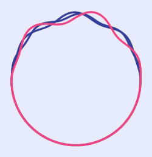

# PolarDrawings

A tiny project playing drawings in polar system.

This is a upgraded [DynamicSineWaveView](https://github.com/tankery/DynamicSineWaveView) with a better constructed code, and draw things in polar coordinator system (To make everything round).



## Usage

1. Copy the View (no resource needed) and files in `data` to your project.
2. Layout with the `me.tankery.demo.polardrawings.DynamicSineWaveView`
3. Add waves for the view programatically.

The layout:

``` xml
<me.tankery.demo.polardrawings.DynamicSineWaveView
    android:id="@+id/view_panel"
    android:layout_width="match_parent"
    android:layout_height="match_parent" />
```

The `addWave` method.

``` java
/**
 * Add new wave to the view.
 *
 * The first added wave will become the 'base wave', which ignored the color & stroke, and
 * other wave will multiple with the 'base wave'.
 *
 * @param amplitude wave amplitude, relative to view, range from 0 ~ 0.5
 * @param cycle contains how many cycles in scene
 * @param speed space per second, relative to view. X means the wave move X times of width per second
 * @param color the wave color, ignored when add the 'base wave'
 * @param stroke wave stroke width, in pixel, ignored when add the 'base wave'
 * @return wave count (exclude the base wave).
 */
public int addWave(float amplitude, float cycle, float speed, int color, float stroke);
```

How to use in code:

``` java
wavesView = (DynamicSineWaveView) findViewById(R.id.view_sine_wave);
wavesView.addWave(1.0f, 0.5f, 0.0f, 0, 0); // Fist wave is for the shape of other waves.
wavesView.addWave(0.2f, 4.5f, 0.2f, getResources().getColor(android.R.color.holo_blue_dark), stroke);
wavesView.addWave(0.3f, 3.5f, 0.3f, getResources().getColor(android.R.color.holo_blue_dark), stroke);
wavesView.addWave(0.5f, 3.0f, 0.5f, getResources().getColor(android.R.color.holo_red_dark), stroke);
wavesView.startAnimation();
```

The data of waves means:

``` java
{1.0f, 0.5f, 0},    // Base wave, full amplitude, half cycle, no speed.
{0.2f, 4.5f, 0.2f}, // bottom wave, small amplitude, 4.5 cycle, slow speed.
{0.3f, 3.5f, 0.3f}, // middle wave, middle amplitude, 3.5 cycle, middle speed.
{0.5f, 3.0f, 0.5f}, // top wave, full amplitude, 3.0 cycle, fast speed.
```

If you need to stop the animation, call:

``` java
wavesView.stopAnimation();
```

What's more, you can even change the `amplitude` when need (useful when you need to response for a voice input):

``` java
wavesView.setBaseWaveAmplitudeScale(1);
```


